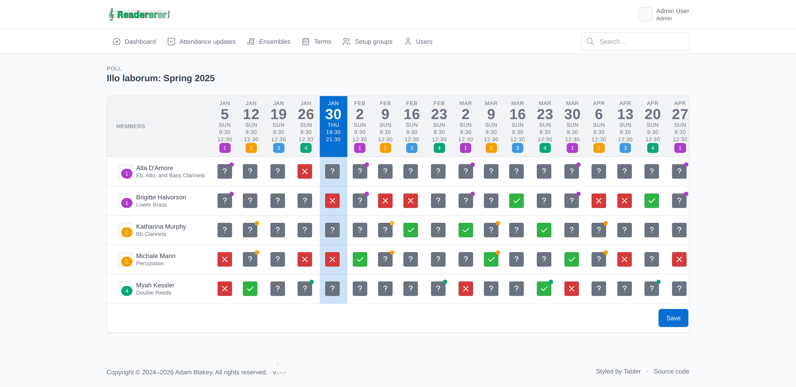

<p align="center">
  
</p>

<p align="center">
  <strong>Attendance, rosters and a digital music library for community ensembles and orchestras.</strong>
</p>

<p align="center">
  
  
  
  
  
</p>

---

Readererer is a web app for running the admin side of a music ensemble. It keeps
track of who plays what, when the group rehearses and performs, and — crucially —
**who is turning up**. Members reply to a term's attendance poll, and conductors and
committee members get a clear register of attending / not attending / not-yet-replied
for every rehearsal and concert. Alongside attendance it manages ensembles, seating
plans, setup-group and van-driver rosters, and a library of setlists, pieces and parts.

## The attendance poll

The heart of the app. Each term shows every member against every rehearsal and concert
date, with a three-state control per date — **attending** (green), **not attending**
(red) or **not yet replied** (grey `?`). Members can update their own answers; totals
always use the latest reply per member.



## Features

**Running the calendar (attendance diary)**

- **Members & users** with per-ensemble instrument family and seat position.
- **Ensembles** — a member can belong to several; each carries its own roster and seating.
- **Terms & term dates** — a date with no ensemble is a rehearsal, otherwise it is that
  ensemble's concert. Terms cache their latest date for quick display.
- **Attendance polls & register** — three-state replies, with attending / not-attending /
  unknown totals per date (latest reply per member wins). Behaviour is tunable via config
  (`readererer_assume_attending`, `readererer_allow_change_to_unknown`,
  `readererer_repeating_headings`).
- **Seating plans** — per-ensemble seat rows and columns, downloadable as a PDF.
- **Setup groups & van drivers** — rosters for who sets up and who drives, per date.

**The music library (digital sheet music)**

- **Composers, pieces and parts** — each part is tied to an instrument family.
- **Setlists** — group pieces together and attach them to term dates.

**Throughout**

- **Role-based access** — `Guest`, `Ensemble` (a shared login that can only fill in
  polls), `Member`, `Moderator` and `Admin`.
- **Convention-driven CRUD** — most entities share generic index / show / form views that
  are built by reflecting over the model, so adding a field to a migration and `$fillable`
  is usually enough to surface it in the UI.
- **Soft deletes with restore**, sortable index tables, and Tabler icons throughout.

## Tech stack

| Layer      | Choice                                                             |
| ---------- | ------------------------------------------------------------------ |
| Framework  | Laravel 11 (PHP 8.2+)                                              |
| Frontend   | Blade + [Tabler](https://tabler.io) UI + Tailwind, bundled by Vite |
| Database   | SQLite (`database/database.sqlite`)                               |
| PDFs       | `barryvdh/laravel-dompdf`                                          |
| Sorting    | `s-damian/larasort`                                               |
| Tests      | [Pest](https://pestphp.com)                                       |
| Formatting | [Laravel Pint](https://laravel.com/docs/pint)                     |

## Getting started

**Requirements:** PHP 8.2+, Composer, and Node.js.

```bash
# Install dependencies
composer install
npm install

# Create your environment file and app key
cp .env.example .env
php artisan key:generate

# Create the SQLite database, run migrations and seed sample data
touch database/database.sqlite
php artisan migrate:fresh --seed
```

Run the app with the PHP dev server and Vite in two terminals:

```bash
php artisan serve   # http://localhost:8000
npm run dev         # Vite dev server / HMR
```

Then log in with one of the seeded accounts — `admin` / `password` gives you the full
admin view (there is one seeded user per role: `guest`, `ensemble`, `member`,
`moderator`, `admin`, all with the password `password`).

To build assets for production instead of running the dev server:

```bash
npm run build
```

### Tests & formatting

```bash
php artisan test                 # or ./vendor/bin/pest
./vendor/bin/pest --filter 'name of test'

./vendor/bin/pint                # format
./vendor/bin/pint --test         # check formatting only
```

## Deployment

Deployment is GitLab-CI driven (`.gitlab-ci.yml`) using Laravel Envoy (`Envoy.blade.php`)
over SSH. Pushing a `v*` tag deploys `main` to the demo server; the `develop` branch
deploys to the test server. The deploy story pulls the latest code, installs
dependencies, compiles assets, migrates (optionally seeds) and brings the app back up.

## Project status

Active development. Work is organised into two phases — the **attendance diary** (members,
ensembles, terms, polls, seating, rosters, notifications) and the **digital sheet music**
library (composers, pieces, parts, setlists). See [`docs/todos.md`](docs/todos.md) for the
outstanding work in each phase.

## Copyright

© 2024–present Adam Blakey. All rights reserved.
